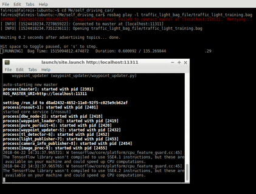

# Self-Driving Car Nanodegree - Capstone

This is the project repo for the final project of the Udacity Self-Driving Car Nanodegree: Programming a Real Self-Driving Car. For more information about the project, see the project introduction [here](https://classroom.udacity.com/nanodegrees/nd013/parts/6047fe34-d93c-4f50-8336-b70ef10cb4b2/modules/e1a23b06-329a-4684-a717-ad476f0d8dff/lessons/462c933d-9f24-42d3-8bdc-a08a5fc866e4/concepts/5ab4b122-83e6-436d-850f-9f4d26627fd9).

## Team Members

| Name  | Email | Responsibilities & Contributions |
| ----- | ----- | ---------------- | 
| [Ramesh Misra](http://github.com/rameshmisra)  | ramesh.misra@gmail.com     | Team Lead |
| [Alan Gordon](http://github.com/alangordon258) | alangordon258@gmail.com    | Trajectory planner and control |
| [Andrea Dranberg](http://github.com/merberg)   | merrick.dranberg@gmail.com | Traffic Light Classification |
| [Felipe Reis](http://github.com/falreis)       | falreis@gmail.com          | Trajectory planner and control |

## Contents

* [Installation](#installation)
* [System Details](#system-details)
  * [Software Architecture](#software-architecture)
  * [Subsystems](#subsystems)
  * [Perception Subsystem](#perception-subsystem)
    * [Traffic Light Detection and Classification](#traffic-light-detection-and-classification)
    * [Obstacle Detection](#obstacle-detection)
  * [Planning Subsystem](#perception-subsystem)
    * [Waypoint Loader](#waypoint-loader)
    * [Waypoint Updater](#waypoint-updater)
  * [Control Subsystem](#control-subsystem)
    * [Twist Controller](#twist-controller)
    * [Waypoint Follower](#waypoint-follower)
    * [Drive-By-Wire Node](#dbw-node)
* [Test and Running](#test-and-running)
  * [Testing in Simulator](#testing-in-simulator)
  * [Testing with Real Data](#testing-with-real-data)
  * [Running in Real World](#running-in-real-world)
* [Next Steps](#next-steps)
  * [Goals](#goals)
  * [Known Issues](#known-issues)

## Installation

Please follow detailed information about how to install and configure the project [here](https://github.com/Merberg/CarND-Capstone/blob/master/installation.md).

## System Details

This section contains information about software architecture and some details of the implementation.

The code is written in Python and C++. Also, it uses some libraries like [Tensorflow](https://www.tensorflow.org/) and [ROS](http://www.ros.org/). 

### Software Architecture

The system architecture diagram shows ROS nodes and topics used in the project 

*(Software Architecture - diagram was provided by Udacity)*

### Subsystems

#### Perception Subsystem

Perception subsystem provides information about the environment and transfers to the other subsystems. It uses cameras and sensor information to detect obstacles and traffic lights. Also, the perception subsystem needs to classify information before share with other subsystems.

##### Traffic Light Detection and Classification

Traffic Light Detection is responsible for identifying traffic lights in the images provided by the camera. The detection needs to identify different situations like brightness, sun exposure, fog, rain and all other natural events, consisting of a challenge.

Traffic Light Classification is the ability to classify the colors in a detected traffic light. Like traffic light detection, the classifier needs to work properly in a range of different natural scenarios.

In this project, traffic light detection and classification are separated into different parts that communicating using ROS topics. The detection node provides information to the classifier node, that classifies the information and provides to the planning and controller subsystems.

To provide correct detection and classification over different scenarios, this nodes uses a pre-trained deep neural network (DNN) with [Bosch Small Traffic Lights](https://hci.iwr.uni-heidelberg.de/node/6132)  and the [Kaggle LISA Traffic Light](https://www.kaggle.com/mbornoe/lisa-traffic-light-dataset/version/2) datasets.

The DNN was trained using Tensorflow Object Detection API. More details about how the training process was made can be found in our tutorial [here](https://github.com/Merberg/CarND-Capstone/blob/master/training/README.md).

##### Obstacle Detection

Obstacle detection uses sensor and camera information to identify near obstacles, providing safety information for planning and controller subsystems.

*In this project, obstacle detection was not developed.*

#### Planning Subsystem

Planning subsystem uses information of the perception subsystem and other sensors (like velocity, orientation, etc) to plan the vehicle's path. This subsystem defines the best route and publishes a list of waypoints representing the planned path. The waypoints are used by the control subsystem.

##### Waypoint Loader

In the simulator, waypoints consist of a CSV file that contains waypoints of the simulation. In a real-world test for this project, this waypoints will be replaced by the real world waypoints. Outside of this project, waypoint loader must be replaced by information provided by sensors.

##### Waypoint Updater

Waypoint updater is the node responsible read information of the loaded waypoints and processes it. It's used also information of the velocity, direction and traffic lights to provide a new list of waypoints, with the planned path (with expected velocity and orientation). The waypoint updater updates the planned path every new cycle, adjusting the path with current information of velocity and other events that can happen in the travel.

One important parameter to tuning is the number of information that needs to be updated. The reliability of the information decreases as far away they are from the current position. Also, this requires more time processing it. Then this parameter must be tuned to provide enough information to the control subsystem with reliability and quickness.

#### Control Subsystem

The Control Subsystem is responsible for using a planning subsystem's information and publishes the commands to the throttle, brake and the steering wheel. The controller subsystem is also responsible to keep the path as planned with a smooth trajectory, without high accelerate or brake.

##### Twist Controller

Twist Controller is an implementation combining PID Controller, Yaw Controller, and a Low Pass Filter. This controller is responsible for use the information about the vehicle (mass, fuel capacity, max steering angle, etc), and define the values of throttle, brake and the angle of the steering wheel.

* **PID controller**: has the responsibility to define the throttle value of the vehicle, minimizing error in a sample time. 
* **Yaw controller**: has the responsibility to define the steering angle, for the current velocity, acceleration, and other variables.
* **Low-Pass Filter**: it's not a controller but a filter to limit to restrict the frequency and attenuates signals that are higher than a certain value (called cutoff frequency)
* ***Brake Controller***: it is part of twist controller and define the value for the brake

Twist Controller give the proposal angular and linear velocities and share this information (using Waypoint Follower) to DBW Controller apply to the vehicle.

##### Waypoint Follower

The Waypoint follower is a set of classes and functions provided by Udacity and it is developed in C++. It uses information of Twist Controller and provide a single topic, with angular and linear velocities.

##### DBW Node

DBW Node has the responsibility to get the proposal angular and linear velocities given by Waypoint Follower and transfer it to the Drive-By-Wire system. DBW Node must guarantee to publish the information in a correct frequency (50Hz) to keep the vehicle with enough data, working properly. If the information is below the frequency, the Drive-By-Wire system may stop the connection due to insufficient data. 

## Test and Running

### Testing in Simulator

To develop the project, the first step is to run the code in a simulator provided by Udacity. The simulator communicates with the code and reproduces the behavior of Carla (Udacity's Car) in a closed scenario, under control.

### Testing with Real Data

After running the code in a simulation scenario with fake data, we can increase the complexity and run the code with real data. This scenario uses a [bag](http://wiki.ros.org/Bags) with stored real data and "is generally no different from having ROS nodes send the same data, though you can run into issues with timestamped data stored inside of message data". This scenario provides a feedback of possible problems the car will face in the real environment. 

 

### Running in Real World

Coming soon..

## Next Steps

This section shows the next steps for the project, our goals, and known bugs.

### Goals

1. Implement Object detection
2. Improve car behavior in different scenarios

### Known Issues
